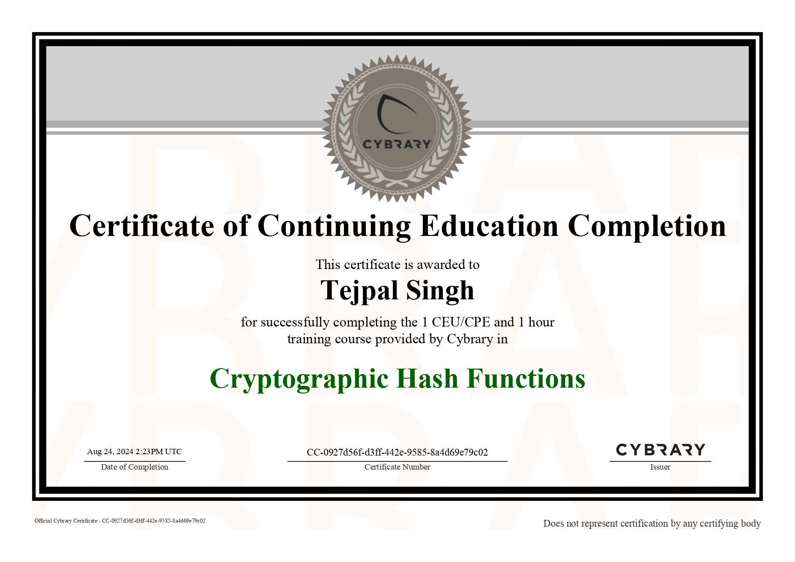
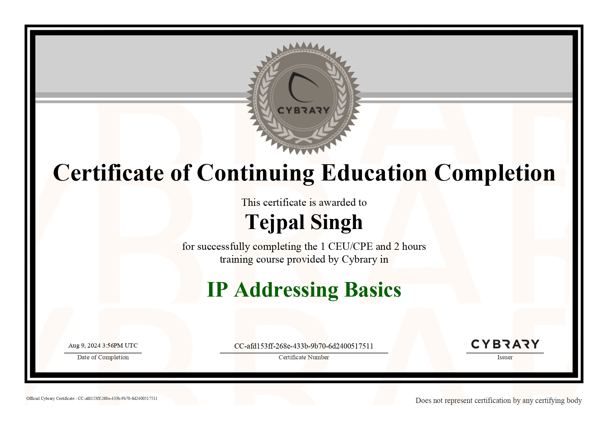
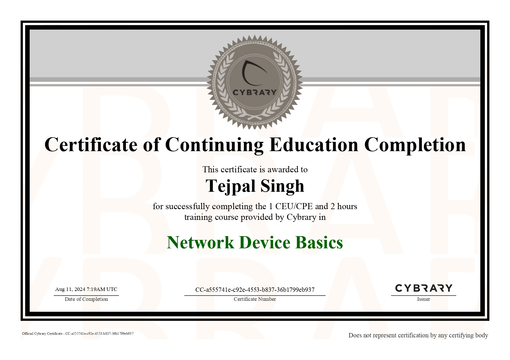
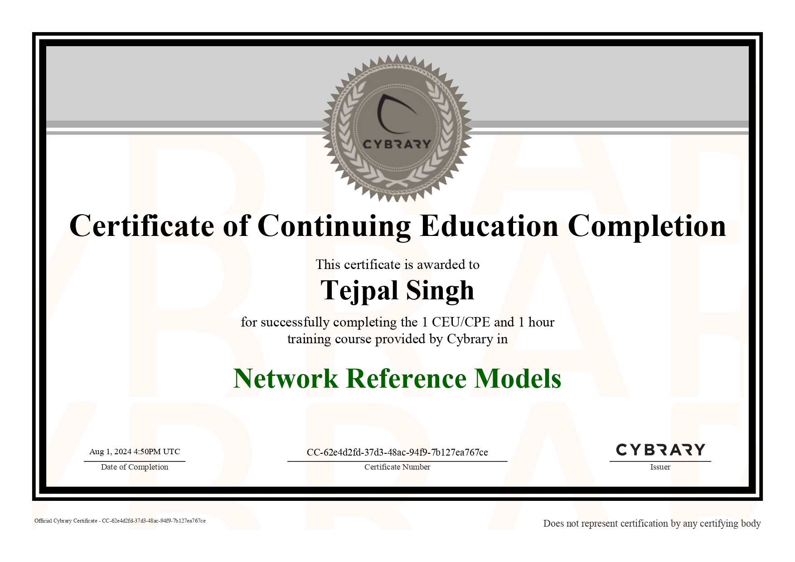

# Hello, I'm TEJPAL SINGH TOMAR.

I am a second-year B.Tech IT student with a keen interest in cybersecurity and ethical hacking. Passionate about securing digital systems, I am eager to learn, explore vulnerabilities, and contribute to creating a safer cyberspace.

## Objective
To showcase my journey and projects in cybersecurity and ethical hacking, demonstrating skills in vulnerability assessment, threat analysis, and secure coding practices. This Platform serves as a platform to share tools, tutorials, and solutions aimed at enhancing digital security and fostering a safer cyberspace.

## Skills
[Provide skills and associated project. Make sure to hyperlink the project]
[Provide skills and associated project. Make sure to hyperlink the project - Remove this afterwards]]

| Skill                                         | Associated Project         |
|-----------------------------------------------|----------------------------|
| SIEM Implementation and Log Analysis          | <a href="https://github.com/Test-MyDFIR/Detection-Lab/tree/main">Detection Lab</a>|
| SIEM Implementation and Log Analysis          | <a href="https://google.com">Detection Lab</a>|
| Network Traffic Monitoring and Attack Detection | <a href="https://google.com">Detection Lab</a>|
| Security Automation with Shuffle SOAR         | SOC Automation Lab|
| Incident Response Planning and Execution      | SOC Automation Lab|
| Case Management with TheHive                  | SOC Automation Lab|
| Scripting and Automation for Threat Mitigation | SOC Automation Lab|

## Certifications

  
My journey in Information Technology has led me to develop a passion for cybersecurity.

## Projects
- <a href="https://github.com/Test-MyDFIR/Detection-Lab/tree/main">Detection Lab</a>
- Detection Lab
- SOC Automation Project
- Test Project
